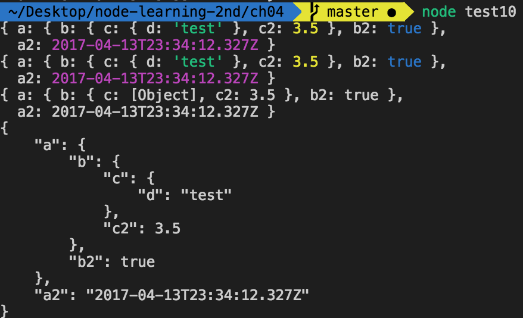

# REPL與控制台

探索Node與自訂模組或應用程式時，無需輸入JavaScript到檔案並以Node執行來測試你的程式。Node有個稱為REPL或read-eval-print loop的互動元件。

REPL(發音“repple”)支援簡化的行編輯與一組基本命令。

有趣的技巧：

- 替換底層處理命令的機制
- 一些命令列編輯功能
- API供建構自訂的REPL

## REPL：初探與未定義運算式

使用REPL：

```
$ node
```

接下來命令列會顯示提示符號(`>`)。從這裡輸入的任何東西會被底層V8 JavaScript引擎處理。

```
> a = 2
2
```

```
> b = ['a', 'b', 'c'];
['a', 'b', 'c']
```

此工具會輸出你輸入的運算式結果。

要存取最後一次運算式，使用特殊底線變數(_)。下面的a被設為2、將運算式結果加1，然後再加1：

```
> a = 2;
2
> ++_;
3
> ++_;
4
```

你甚至可存取底線運算式的屬性或呼叫其方法：

```
> ['apple', 'orange', 'lime']
[ 'apple', 'orange', 'lime' ]
> _.length
3
> 3 + 4
7
> _.toString();
'7'
```

可在REPL使用var關鍵字以供稍後存取運算式或值，但可能會遇到意料外的結果。

```
> var a = 2;
undefined
```

它並不回傳2值，而是回傳undefined值。運算式的結果為未定義是由於變數指派在求值時不回傳結果。

```
> console.log(eval('a = 2'));
2
undefined
> console.log(eval('var a = 2'));
undefined
undefined
```

REPL代表read-eval-print-loop，強調的是`eval`。

按Ctrl-C兩次或Ctrl-D一次以結束REPL。

## REPL的好處：近一步認識底層JavaScript

以下是REPL典型示範：

```
> 3 > 2 > 1
false
```

在JavaScript求值中，運算子從左到右求值，而每個運算式結果會回傳供下一次求值。

```
> 3 > 2 > 1;
false
> 3 > 2
true
> true > 1
false
```

REPL用途是讓我們發現JavaScript的這些小技巧。

## 多行更複雜的JavaScript

```
> qs = require('querystring');
{ unescapeBuffer: [Function: unescapeBuffer],
  unescape: [Function: qsUnescape],
  escape: [Function: qsEscape],
  stringify: [Function: stringify],
  encode: [Function: stringify],
  parse: [Function: parse],
  decode: [Function: parse] }
> val = qs.parse('file=main&file=secondary&test=one').file;
[ 'main', 'secondary' ]
```

沒使用var關鍵字，運算式結果會被輸出。

除了能操作外部模組外，REPL還可優雅處理多行運算式，以大括弧來表示套疊的程式。

```
> var test = function(x, y) {
... var val = x * y;
... return val;
... };
undefined
> test(3, 4);
12
```

REPL以重複的點表示右大括弧後面輸入的內容還沒結束。它對右括號也是這樣。

```
> test(3,
... 4);
12
```

加深的套疊會產生更多的點：這在互動環境中是必要的。

```
> var test = function(x, y) {
... var test2 = function(x, y) {
..... return x * y;
..... }
... return test2(x, y);
... }
undefined
> test(3, 4);
12
```

可輸入或貼上整個Node應用程式給REPL並加以執行。

```
> var http = require('http');
undefined
> http.createServer(function(req, res) {
...     res.writeHead(200, {'Content-Type': 'text/plain'});
...     res.end('Hello person\n');
... }).listen(8124);
Server {
  domain:
   Domain {
     domain: null,
     _events: { error: [Function: debugDomainError] },
     _eventsCount: 1,
     _maxListeners: undefined,
     members: [] },
  _events:
   { request: [Function],
     connection: [Function: connectionListener] },
  _eventsCount: 2,
  _maxListeners: undefined,
  _connections: 0,
  _handle:
   TCP {
     bytesRead: 0,
     _externalStream: {},
     fd: 15,
     reading: false,
     owner: [Circular],
     onread: null,
     onconnection: [Function: onconnection],
     writeQueueSize: 0 },
  _usingSlaves: false,
  _slaves: [],
  _unref: false,
  allowHalfOpen: true,
  pauseOnConnect: false,
  httpAllowHalfOpen: false,
  timeout: 120000,
  _pendingResponseData: 0,
  maxHeadersCount: null,
  _connectionKey: '6::::8124' }
> console.log('Server running at http://127.0.0.1:8124/');
Server running at http://127.0.0.1:8124/
undefined
```

作者最喜歡REPL的一點是可以快速檢視物件。

```
console.log(global);
```

```
> gl = global
```

```
> global
```

可使用上下鍵叫出曾經在REPL輸入過的內容。但有些限制。

```
> var myFruit = function(fruitArray, pickOne) {
... return fruitArray[pickOne - 1];
... }
undefined
> fruit = ['apples', 'oranges', 'limes', 'cherries'];
[ 'apples', 'oranges', 'limes', 'cherries' ]
> myFruit(fruit, 2);
'oranges'
> myFruit(fruit, 1);
'apples'
> myFruit(fruit, 0);
undefined
> myFruit(fruit, 0);
undefined
> var myFruit = function(fruitArray, pickOne) {
... if (pickOne <= 0) return 'invalid number';
... return fruitArray[pickOne - 1];
... }
undefined
> myFruit(fruit, 0);
'invalid number'
> myFruit(fruit, 1);
'apples'
```

可用方向鍵重複之前內容輸入。

以操作正規表示式就很好用：

```
> var ssRe = /^\d{3}-\d{2}-\d{4}$/;
undefined
> ssRe.test('555-55-5555');
true
> var decRe = /^\s*(\+|-)?((\d+(\.\d+)?)|(\.\d+))\s*$/;
undefined
> decRe.test(56.5)
true
```

可免測試重新輸入。

REPL可使用Tab鍵自動完成命令輸入。

REPL上想儲存，可使用`.save`命令儲存目前內容。

### REPL命令

REPL有簡單的介面與一組實用的命令。`.save`可將目前內容儲存到檔案中。除非下令建構新的物件背景或使用`.clear`命令，否則內容會包含在所有REPL的輸入：

```
> .save ./dir/session/save.js
```

只有你的輸入會儲存。

以下列出REPL命令與其功能：

- .break

    如果輸入多行時忘記位置，輸入.break可重新開始，前面的輸入會被清除

- .clear

    重置背景物件並清除所有表達式。此命令基本上就是重新開始

- .exit

    結束REPL

- .help

    顯示所有REPL命令

- .save

    儲存目前REPL過程到檔案中

- .load

    載入檔案(`.load /path/to/file.js`)


### REPL與rlwrap

設定環境變數以在REPL上使用rlwrap

rlwrap工具是將GNU的readline函式庫功能加到命令列以加強鍵盤輸入彈性的包裝程式。它攔截鍵盤輸入並提供額外的功能，像是加強版的行編輯及命令歷史紀錄保存。

你必須安裝rlwrap與readline以在REPL中使用其功能。

```
$ apt-get install rlwrap
```

以下是在RPEL上使用rlwrap來改變REPL提示成紫色的示範：

```
NODE_NO_READLINE=1 rlwrap --ppurple node
```

想永久改變，可在我的bashrc檔案加上別名：

```
alias node="NODE_NO_READLINE=1 rlwrap --ppurple node"
```

有要改變提示與顏色：

```
NODE_NO_READLINE=1 rlwrap --ppurple -S "::>" node
```

如此提示會是(還是紫色的)：

```
::> 
```

rlwrap特別有用的元件是跨REPL過程的歷史紀錄儲存能力。使用rlwrap，操作REPL能存取過去的歷史紀錄(以及其他命令列輸入)。

但每次輸入沒有回傳值的表示式會得到undefined。然而我們可以建構**自訂的REPL**來調整這個功能與其他功能。

### 自訂REPL

Node提供的API可用來建構自訂的REPL。首先須引用REPL模組：

```
var repl = require('repl');
```

為建構新的REPL，我們呼叫repl物件的start方法

```
repl.start(options);
```

options物件取用數個值；我想強調的是:

- prompt

    預設為>

- input

    可讀串流；預設為process.stdin

- output

    可寫串流；預設為process.stdout

- eval

    預設為eval的async

- useGlobal

    預設false以啟動新的背景而非使用全域物件

- useColors

    設定writer函式是否使用顏色。預設為REPL的terminal值

- ignoreUndefined

    預設為false：不忽略undefined回應

- terminal

    若串流應該當作tty(終端機)處理則設為true，包括ANSI/VT100跳脫碼的資源

- writer

    對命令列求值與回傳格式化的函式。預設為util.inspect

- replMode

    設定strict、default，或hybrid模式

※ Node 5.8.0開始，repl.start()不再需要options物件。


建構自訂的REPL：

```
var repl = require('repl');

repl.start({
    prompt: 'my repl> ',
    replMode: repl.REPL_MODE_STRICT,
    ignoreUndefined: true,
})
```

使用Node執行此稱為repl.js的檔案：

```
$ node repl
my repl> let ct = 0;
my repl> ct++;
0
my repl> console.log(ct);
1
my repl> ++ct;
2
my repl> console.log(ct);
2
my repl>
```

提示不一樣，惱人的undefined也不再有了。

options物件中沒列出的其他屬性會使用預設值。

可在自訂的REPL中替換eval函式，唯一要求是它具下列格式：

```
function eval(cmd, callback) {
    callback(null, result);
}
```

input與output選項範例：Node.js官網的REPL文件有提供下列傾聽TCP socket的REPL

```
var net = require("net"),
    repl = require("repl");

connections = 0;

repl.start({
    prompt: "node via stdin>",
    input: process.stdin,
    output: process.stdout
});

net.createServer(function (socket) {
    connections += 1;
    repl.start({
        prompt: "node via Unix socket>",
        input: socket,
        output: socket
    }).on('exit', function() {
        socket.end();
    })
}).listen("/tmp/node-repl-sock");

net.createServer(function(socket) {
    connections+=1;
    repl.start({
        prompt: "node via TCP socket>",
        input: socket,
        input: socket
    }).on('exit', function() {
        socket.end();
    });
}).listen(5001);
```

Linux的Telnet用戶端沒問題。但從Telnet執行REPL不在計畫中，不推薦這麼做一至少不能沒有高度安全性。如同用戶端程式使用`eval()`且沒檢查使用者輸入要執行的內容。

可透過Unix的Socket與GNU的Netcat之類的工具執行REPL並保持通訊：

```
nc -U /tmp/node-repl-sock
```

可如同使用stdin一般輸入命令。但要注意如果使用TCP或Unix的socket，console.log命令會輸出到伺服器控制台。

作者覺得更實用的REPL應用程式選項是預先載入模組。

以下REPL啟動後，預載入Request(HTTP用戶端)、Underscore(工具函式庫)與Q(promise管理)模組會被載入並指派給背景屬性：

```
var repl = require('repl');
var context = repl.start({
    prompt: '>> ',
    ignoreUndefined: true,
    replMode: repl.REPL_MODE_STRICT
}).context;

context.request = require('request');
context.underscore = require('underscore');
context.q = require('q');
```

然後我們可以存取這些模組：

```
>> request('http://burningbird.net/phoenix5sm.png').pipe(fs.createWriteStream('bird.png'));
```

如果想如同Linux上的可執行檔案一樣執行REPL應用程式，在應用程式加上以下內容作為第一行：

```
#!/usr/local/bin/node
```

修改檔案成可執行檔並執行：

```
$ chmod u+x replcontext.js
$ ./replcontext.js
```

## 天有不測風雲，經常存檔

REPL讓我們開發工作較為簡單。REPL不只讓我們在引入JavaScript前進行測試，還可互動的建構應用程式然後於完成時儲存檔案。

另一個好用的REPL功能是它讓我們建構自訂的REPL以消除無意義的undefined回應、預先載入模組、改變提示符號或eval程序等。

強烈建議使用REPL時加上rlwrap以跨交談過程儲存命令，如此可省下大量時間。

但有個重點要記住：天有不測風雲，經常存檔!!

## 控制台的必須品

控制台是輸出值、檢查操作、檢驗應用程式非同步本質，與提供回饋的方式。

控制台有比瀏覽器的警告對話框有更多的內容。

### 控制台訊息型別、控制台類別與阻斷

`console.log`此函式輸出訊息到stdout，通常是終端機。當你開始為交付環境打造Node應用程式時，你會想要使用其他的控制台訊息函式。

- `console.info()`函式等同`console.log()`，兩者都輸出到stdout；兩者的輸出訊息都帶有換行字元
- `console.error()`函式則輸出到stderr(同樣帶有換行字元)

`console.warm()`函式也一樣。

為理解差別性，必須深入檢視：

※ 使用紀錄模組：更複雜的工具可用，例如Bunyan與Winston模組。

首先，console物件是從Console類別初始化的全域物件。如果要的話，可使用一個類別建構自己的console。這有兩個方式：

要建構新的Console實例，必須匯入Console類別或透過全域的console物件存取：

```
var Console = require('console').Console;

var cons = new Console(process.stdout, process.stderr);
cons.log('testing');

var cons2 = new console.Console(process.stdout, process.stderr);
cons2.error('test');
```

`process.stdout`與`process.stderr`屬性作為可寫入的串流實例傳遞以輸出紀錄訊息與錯誤訊息。console全域物件也是以這種方式建構。

`process.stdout`與`process.stderr`，它們對應環境中的stdout與stderr，且與大部分Node串流不同的是它們通常會阻斷一它們是同步的。唯一非同步的時候是串流被導向到pipe上。大部分情況下，console物件會被`console.log()`與`console.error()`阻斷。但這不會是問題，除非你導引大量資料到串流上。

發生錯誤要使用console.error() ?

- 如果處於紀錄訊息不會阻斷但錯誤訊息會阻斷的環境中，你會想要確保Node錯誤會阻斷。
- Node應用程式，可使用命令列重新導向功能將console.log()與console.error()的輸出導向到不同檔案。

```
console.log('this is informative');
console.info('this is more information');

console.error('this is an error');
console.warn('but this is only a warning');
```

```
node app.js 1> app.log 2> error.log
```

回到Console類別，你可以使用Console類別並傳入process.stdout與process.stderr來複製全域console物件的功能。你也可以建構新的控制台物件，將輸出導向不同的串流，例如紀錄與錯誤檔案。

Node Foundation提供Console文件有個範例：

```
var fs = require('fs');
var Console = require('console').Console;

var output = fs.createWriteStream('./stdout.log');
var errorOutput = fs.createWriteStream('./stderr.log');

// 自訂簡單紀錄工具
var logger = new Console(output, errorOutput);

// 使用方式如同console
var count = 5;
logger.log(`count: %d`, count);

// stdout.log檔案：count: 5
```

使用這種類型的物件好處是你可以使用全域的console處理一般回饋，保留新建構的物件處理正式的報告。

### 以util.format()與util.inspect()輔助訊息格式化

console的log()、warn()、error()與info()四個函式可以取用任何資料型別，包括物件。非字串的非物件值會強制轉換成字串。如果資料型別是物件，要注意Node只會輸出**兩**層，你應該對物件使用`JSON.stringify()`，他會輸出更可讀的縮排樹：

```
var test = {
    a:{
        b:{
            c:{
                d: 'test'
            }
        }
    }
};

// 只輸出兩層
console.log(test);

// 輸出三層
var str = JSON.stringify(test, null, 3);
console.log(str);
```

如果使用字串，你可對這四個函式使用類似printf的格式化：

```
var val = 10.5;
var str = 'a string';

console.log(`The value is %d and the string is %s`, val, str);
```

這在資料作為函式參數或搜集自網頁請求時很方便。格式化的類型是根據`util.format()`工具模組支援的格式化進行，也可直接使用：

```
var util = require('util');

var val = 10.5,
    str = 'a string';

var msg = util.format('The value is %d and the string is %s', val, str);
console.log(msg);
```

若只使用此函式，`console.log`比較方便。可用的格式值：

- %s：字串
- %d：數字
- %j：JSON。如果參數帶有循環參考則會替換成['circular']
- %%：使用百分比符號實作(%)

取出的參數會轉換成字串並連接到輸出。如果參數太少會輸出它本身。

```
var val = 3;

console.log(`val is %d and str is %s`, val);
```

此處討論的四個函式不是唯一回饋方式，還有`console.dir()`。

`console.dir()`函式與其他回饋函式不同在於傳入的物件會傳給`util.inspect()`。此工具模組函式透過options物件提供有限的顯示控制。如同util.format()，他也可以直接使用：

```
var test = {
    a:{
        b:{
            c:{
                d: 'test'
            }
        }
    }
};

var str = require('util').inspect(test, {showHidden: true, depth: 4});
console.log(str);
```

物件被檢查並根據options物件將結果以字串回傳。選項有：

- showHidden：顯示不可列舉或符號特性(default是false)
- depth：檢查物件的遞迴次數(default是2)
- colors：若為true則使用ANSI顏色編碼輸出(default是false)
- customInspect：若為false則不呼叫自訂檢查函式(default是true)

色彩對應可使用`util.inspect.styles`物件全域定義。你也可以修改全域色彩。使用console.log()輸出此物件的屬性。

```
var util = require('util');

console.log(util.inspect.styles);
console.log(util.inspect.colors);
```

其結果：

```
{ special: 'cyan',
  number: 'yellow',
  boolean: 'yellow',
  undefined: 'grey',
  null: 'bold',
  string: 'green',
  symbol: 'green',
  date: 'magenta',
  regexp: 'red' }
{ bold: [ 1, 22 ],
  italic: [ 3, 23 ],
  underline: [ 4, 24 ],
  inverse: [ 7, 27 ],
  white: [ 37, 39 ],
  grey: [ 90, 39 ],
  black: [ 30, 39 ],
  blue: [ 34, 39 ],
  cyan: [ 36, 39 ],
  green: [ 32, 39 ],
  magenta: [ 35, 39 ],
  red: [ 31, 39 ],
  yellow: [ 33, 39 ] }
```

範例：

- 修改被輸出的物件以加上日期、數字與布林。
- 布林值顏色從黃色改成藍色以區分數字(預設都是黃色)
- 物件使用不同方法輸出

    - 以`util.inspect()`處理後使用`console.dir()`加上相同選項
    - 使用基本的`console.log()`函式
    - 使用物件上的`JSON.stringify()`函式

    
```
var util = require('util');

var today = new Date();

var test = {
    a: {
        b: {
            c: {
                d: 'test'
            },
            c2: 3.50
        },
        b2: true
    },
    a2: today
};

util.inspect.styles.boolean = 'blue';

// 以util.inspect直接格式化
var str = util.inspect(test, { depth: 4, colors: true });
console.log(str);

// 使用console.dir與選項輸出
console.dir(test, { depth: 4, colors: true });

// 使用基本的console.log輸出
console.log(test);

// 和JSON.stringify
console.log(JSON.stringify(test, null, 4));
```

結果：



※ console.dir()函式支援util.inspect()四個選項中的三個：showHidden、depth，與colors。它不支援customInspect。如果設為true，此選項表示物件實際上提供自己的檢查函式。

### 以控制台與計時器提供更多回饋

回到console物件，另一個提供更多應用程式資訊的方式是加上計時器並輸出開始與結束時間。

- `console.time()`
- `console.timeEnd()`

兩者都傳入計時器名稱

```
console.time('the-loop');

for (var i = 0; i < 10000; i++) {
    ;
}

console.timeEnd('the-loop');
```

結果：

```
the-loop: 0.160ms
```

計時器不限於同步事件，也可在非同步事件上使用(因能指定計時器名稱)。

```
var http = require('http');

console.time('hello-timer');
http.createServer(function(req, res) {
    res.writeHead(200, {'Content-Type': 'text/plain'});
    res.end('Hello World\n');
    console.timeEnd('hello-timer');
    console.time('hello-timer');
}).listen(8124);

console.log(`Server running at http:/127.0.0.1:8124`);
```

```
Server running at http:/127.0.0.1:8124
hello-timer: 17748.353ms
hello-timer: 266.663ms
hello-timer: 10397.440ms
hello-timer: 101.871ms
```