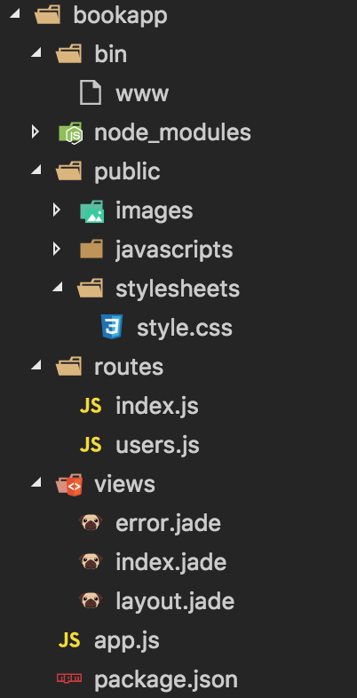

# Node全端開發

這表示熟悉資料系統、API、用戶端開發一全都使用一種技術：Node。

最常見Node全端開發形式是MEAN一MongoDB、Express、AngularJS與Node。全端開發可由其他工具組成。但Express還是很常見，使用Node會需要熟悉Express。

## Express應用程式架構

建構Node網頁應用程式的任務不簡單，因此Express之類的應用程式很受歡迎：它提供大部分功能。

```
npm install express --save
```

app.js：

```
var express = require('express');
var app = express();

app.get('/', function(req, res) {
    res.send('Hello World');
});

app.listen(3000, function() {
    console.log(`Example app listening on port 3000!`);
});
```

`app.get()`函式處理所有GET請求，請求與回應物件具預設相同功能，加上Express提供的功能。舉例：回應網頁請求可用`res.write()`與`res.end()`，也可使用Express加強版的`res.send()`。

也可使用Express應用程式產生器來產生應用程式骨架。接下來會使用它，因它更具細節與複雜的Express應用程式。

```
sudo npm install express-generator -g
```

```
express bookapp
```

```
cd bookapp
npm install
```

就這樣，你已建構出第一個骨架的Express應用程式。可使用下列命令執行它(Linux、OS X)：

```
DEBUG=bookapp:* npm start
```

Windows的Command：

```
set DEBUG=bookapp:* & npm start
```

也可使用`npm start`啟動應用程式不除錯。

此應用程式會產生幾個子目錄與檔案：



公開的靜態檔案位於public子目錄下。動態內容樣板檔案位於views。routes子目錄帶有傾聽網頁請求與產生網頁的網路端點應用程式。

bin目錄下的www檔案是應用程式的啟動腳本。它是轉換為命令列應用程式的Node檔案。檢視package.json，會看到它列為應用程式的啟動腳本。

```
{
  "name": "bookapp",
  "version": "0.0.0",
  "private": true,
  "scripts": {
    "start": "node ./bin/www"
  },
  "dependencies": {
    "body-parser": "~1.17.1",
    "cookie-parser": "~1.4.3",
    "debug": "~2.6.3",
    "express": "~4.15.2",
    "jade": "~1.11.0",
    "morgan": "~1.8.1",
    "serve-favicon": "~2.4.2"
  }
}
```

為深入應用程式，接下來會檢視app.js這個應用程式進入點。

app.js。它匯入更多的模組，大部分均提供網頁應用程式所需的**中介軟體**支援。匯入模組包括應用程式指定的部分，位於routes目錄：

```
var express = require('express');
var path = require('path');
var favicon = require('serve-favicon');
var logger = require('morgan');
var cookieParser = require('cookie-parser');
var bodyParser = require('body-parser');

var index = require('./routes/index');
var users = require('./routes/users');

var app = express();
```

以下是模組與其目的：

- express

    Express應用程式

- path

    Node檔案路徑核心模組

- serve-favicon

    從路徑或緩衝區服務favicon.ico檔案的中介軟體

- morgan

    HTTP請求紀錄程序

- cookie-parser

    解析cookie標頭與產生req.cookie

- body-parser

    提供四種不同請求內容的解析程序(但不處理多部份內容)

每個中介軟體模組可對HTTP伺服器與Express操作。

※ 何謂中介軟體？中介軟體系統 / 作業系統 / 資料庫與應用程式之間的介質。在Express中，中介軟體是應用程式鏈的一部分。各具有與HTTP請求有關的特定功能一處理它或為了其他中介軟體應用程式對請求執行某種操作。

下一段app.js程式透過`app.use()`函式載入中介軟體(讓它在應用程式中可用)。中介軟體載入順序很重要。

這一段程式包括定義view引擎的設置：

```
// view engine setup
app.set('views', path.join(__dirname, 'views'));
app.set('view engine', 'jade');

// uncomment after placing your favicon in /public
//app.use(favicon(path.join(__dirname, 'public', 'favicon.ico')));
app.use(logger('dev'));
app.use(bodyParser.json());
app.use(bodyParser.urlencoded({ extended: false }));
app.use(cookieParser());
app.use(express.static(path.join(__dirname, 'public')));
```

最後一個`app.use()`呼叫參考Express內建的中介軟體之一。`express.static`用於處理所有靜態檔案。所有靜態檔案以載入中介軟體時指定的路徑相對關係服務，此例中為public目錄。

view引擎設置的`app.set()`函式，你會使用幫助對應資料的樣版引擎。default：Jade。引擎設置定義樣板檔案(view)的目錄與使用何種引擎(Jade)。

index.jade裡面的值(title)在樣板中如何呈現需要到app.js檔案查看。

```
app.use('/', index);
app.use('/users', users);
```

這些是應用程式的端點，它是回應用戶端請求的功能。頂端請求('/')由routes目錄的index.js處理，使用者由user.js檔案處理。

在index.js檔案中，我們看到Express的router，它提供回應處理功能。router的動作模式：

```
app.METHOD(PATHM HANDKER)
```

method是HTTP方法，Express支援常見的get、post、put與delete，以及merge、search、head、options等較少見的方法。path是網頁路徑，handler是處理請求的函式。

```
var express = require('express');
var router = express.Router();

/* GET home page. */
router.get('/', function(req, res, next) {
  res.render('index', { title: 'Express' });
});

module.exports = router;
```

資料(區域變數)與view在res.render()函式呼叫中相遇。view用於index.jade檔案，可看到樣板中title屬性的值作為資料傳入函式。

app.js檔案其餘部分是錯誤處理。

## MongoDB 與 Redis 資料庫系統

### MongoDB

Node應用程式最常見的資料庫。MongoDB是個以文件為基礎的資料庫。文件被編寫成BSON，一種二進位形式的JSON。相較於資料表的列，你使用BSON文件；相較於資料表，你使用集合。

MongoDB並非唯一一個以文件為中心的資料庫，Node對大部分文件資料庫有各種程度的資源，但MongoDB與CouchDB的支援最好。

Node透過MongoDB Native NodeJS Driver與Mongoose的物件導向支援對MongoDB的支援非常好。

雖然底層資料結構與關連式資料庫不同，但基本概念還是一樣：建構資料庫、建構紀錄集合、加入個別紀錄。

以下MongoDB範例：

```
var MongoClient = require('mongodb').MongoClient;

// 連結資料庫
MongoClient.connect("mongodb://localhost:27017/exampleDb", function (err, db) {
    if (err) return console.error(err);

    // 存取widgets集合
    db.collection('widgets', function (err, collection) {
        if (err) return console.error(err);

        // 刪除所有文件
        collection.remove(null, { safe: true }, function (err, result) {
            if (err) return console.error(err);
            console.log(`result of remove ${result.result}`);
        });

        //建構兩筆紀錄
        var widget1 = {
            title: 'First Great widget',
            desc: 'greatest widget of all',
            price: 14.99
        };
        var widget2 = {
            title: 'Second Great widget',
            desc: 'second greatest widget of all',
            price: 29.99
        };
        collection.insertOne(widget1, { w: 1 }, function (err, result) {
            if (err) return console.error(err);
            console.log(result.insertedId);

            collection.insertOne(widget2, { w: 1 }, function (err, result) {
                if (err) return console.error(err);
                console.log(result.insertedId);

                collection.find({}).toArray(function (err, docs) {
                    console.log(`found documents`);
                    console.dir(docs);

                    // 關閉資料庫
                    db.close();
                });
            });
        });
    });
});
```

可改用promise。

`{w:1}`選項指定MongoDB寫入操作的write concern。

`collection.find()`此函式會建構一個cursor，而`toArray()`函式會將cursor以陣列回傳，然後使用console.dir()輸出。

物件的辨識名稱實際上是個BSON物件，因此無法清楚輸出。如果想更清楚輸出，可將每個欄位的BSON辨識名稱以`toHexString()`轉換成十六進位字串。

```
docs.forEach(function(doc) {
    console.log(`ID: ${doc._id.toHexString()}`);
    console.log(`desc: ${doc.desc}`);
    console.log(`title: ${doc.title}`);
    console.log(`price: ${doc.price}`);
});
```

你可使用命令列工具檢視MongoDB的紀錄。使用下列命令啟動工具並檢視紀錄：

1. 輸入`mongo`啟動命令列工具
2. 輸入`use exampleDb`以使用exampleDb資料庫
3. 輸入`show collections`以檢視所有集合
4. 輸入`db.widgets.find()`以檢視Widget紀錄

如果你偏好在應用程式中使用物件導向方式操作MongoDB，你需要使用Mongoose。它與Express更為合適。

[Node文件中的MongoDB](https://mongodb.github.io/node-mongodb-native/api-articles/nodekoarticle1.html)

### Redis 鍵/值儲存體

談到資料，有關聯式資料庫與NoSQL兩種。在NoSQL類型中，有一種資料結構是根據鍵/值對建構，通常儲存在記憶體中以供快速存取。最常見三種記憶體鍵/值對儲存體是Memcached、Cassandra，與Redis。Node三種都有資源。

Memcached主要用於記憶體快取資料快速存取。它在分散式運算中相當好，但對更複雜的資料結構支援有限。它對大量查詢但較少資料讀寫的應用程式很有用。

Redis是對後面這種應用程式比較好的資料儲存體。此外，Redis可以永久儲存，且比Memcached更有彈性一特別是它支援不同類型資料，但Redis只能在單一機器上運行。

Redis與Cassandra的比較也是有相同的因素。如同Memcached，Cassandra支援叢集，但也如同Memcached，它的資料結構也有限制。它適合任意查詢一這方面Redis比較差。但Redis容易使用、不複雜、通常比Cassandra快。為了這些原因，Redis在Node開發者間越來越常見。

Node的Redis模組安裝：

```
npm install redis
```

如果你計畫在Redis上進行大量操作，建議安裝Node的hiredis模組，它非阻斷且可提升效能：

```
npm install hiredis redis
```

Redis模組是Redis本身的簡單包裝，因此你需花時間學習Redis命令與Redis資料儲存體的運作方式。

使用createClient建構Redis用戶端。

```
var redis = require('redis');
var client = redis.createClient();
```

createClient方法有三個選擇性參數：port、host，與選項。default：host是127.0.0.1，而port是6379，它是Redis伺服器的預設值。

第三個參數是個支援多個選項的物件，詳細說明見模組文件。

用戶端連接Redis資料儲存體後，你可以發送命令給伺服器直到呼叫`client.quit()`為止，它會關閉與Redis伺服器的連線。強制關閉可使用`client.end()`，後者不會等待解析回應。但如果當掉或想重新開始，`client.end()`是好方法。

透過用戶端連線發出Redis命令是相當直覺的程序。所有命令從用戶端物件顯露，而命令參數以參數傳入。Node最後一個參數是callback函式，它回傳錯誤或Redis命令回應的資料。

下列程式中，`client.hset()`方法用於設定**雜湊**屬性。在Redis中，雜湊是字串欄位與值間的對應，例如“lastname”代表姓，“firstname”代表名：

```
client.hset("hashid", "propname", "propvalue", function(err, reply) {
    // 執行錯誤或回應工作
});
```

hset命令設定值，因此不會回傳資料一只有redis的回應。如果呼叫回應多個值的方法，例如`client.hvals`，callback函式的第二個參數會是一個陣列一單一字串的陣列或物件陣列：

```
client.hvals(obj.member, function(err, replies) {
    if (err) {
        return console.error("error response - " + err);
    }
    
    console.log(replies.length + " replies:");
    replies.forEach(function(reply, i) {
        console.log(" " + i + ": " + reply);
    });
});
```

由於Node的callback經常出現且很多Redis命令只是回應成功的操作，Redis模組提供了redis.print方法可作為最後一個參數：

```
client.set("somekey", "somevalue", redis.print);
```

`redis.print`方法輸出錯誤或回應到控制台並返回。

為示範Node上的Redis，這裡建構一個**訊息佇列**。訊息佇列是將某種通訊作為輸入，然後儲存到佇列中(最後面)。訊息被保存直到被訊息接收方取出，此時會從佇列取出(最前面)並發送給接收方(一次一則或一批)。此通訊為非同步，因為儲存訊息的應用程式不需要連接接收方，接收方也不需要連接儲存訊息的應用程式。

Redis是這種運用的理想儲存體。

範例：處理網頁紀錄並將圖檔資源請求發送至訊息佇列的Node應用程式

```
var spawn = require('child_process').spawn;
var net = require('net');

var client = new net.Socket();
client.setEncoding('utf8');

// 連接TCP伺服器
client.connect('3000', 'examples.burningbird.net', function () {
    console.log(`connected to server`);
});

// 啟動子行程
var logs = spawn('tail', ['-f',
    '/home/main/logs/access.log',
    '/home/tech/logs/access.log',
    '/home/shelleypowers/logs/access.log',
    '/home/green/logs/access.log',
    '/home/puppies/logs/access.log']);

// 處理子行程資料
logs.stdout.setEncoding('utf8');
logs.stdout.on('data', function (data) {

    // 資源URL
    var re = /GET\s(\S+)\sHTTP/g;

    // 檢測圖檔
    var re2 = /\.gif|\.png|\.jpg|.svg/;

    // 擷取URL
    var parts = re.exec(data);
    console.log(parts[1]);

    // 若找到圖檔則儲存
    var tst = re2.test(parts[1]);
    if (tst) {
        client.write(parts[1]);
    }
});

logs.stderr.on('data', function (data) {
    console.log(`stderr: ${data}`);
});

logs.on('exit', function (code) {
    console.log('child process exited with code ' + code);
    client.end();
})
```

下列是此應用程式典型的控制台紀錄：

```
/robots.txt
/weblog
/writings/fiction?page=10
/images/kite.jpg
/node/145
/culture/book-reviews/silkworm
/feed/atom/
/images/visitmologo.jpg
/images/canvas.png
/sites/default/files/paws.png
/feeds/atom.xml
```

範例：將訊息加入Redis清單的訊息佇列(TCP Server並傾聽訊息)

```
var net = require('net');
var redis = require('redis');

var server = net.createServer(function (conn) {
    console.log(`connected`);

    // 建構Redis用戶端
    var client = redis.createClient();

    client.on('error', function (err) {
        console.log(`Error ${err}`);
    });

    // 第六個資料庫是圖檔佇列
    client.select(6);
    // 傾聽資料
    conn.on('data', function (data) {
        console.log(`${data} from ${conn.remoteAddress} ${conn.remotePort}`);

        // 儲存資料
        client.rpush('images', data);
    });
}).listen(3000);

server.on('close', function(err) {
    client.quit();
});

console.log(`listening on port 3000`);
```

訊息佇列應用程式的控制台紀錄類似這樣：

```
listening on port 3000
connected
/images/venus.png from 173.255.206.103 39519
/images/kite.jpg from 173.255.206.103 39519
/images/visitmologo.jpg from 173.255.206.103 39519
/images/canvas.png from 173.255.206.103 39519
/sites/default/files/paws.png 173.255.206.103 39519
```

範例：從Redis清單取出訊息並回傳給使用者的HTTP伺服器

```
var redis = require('redis'),
    http = require('http');

var messageServer = http.createServer();

// 傾聽請求
messageServer.on('request', function (req, res) {

    // 濾掉icon請求
    if (req.url === '/favicon.ico') {
        res.writeHead(200, { 'Content-Type': 'image/x-icon' });
        res.end();
        return;
    }

    // 建構Redis用戶端
    var client = redis.createClient();

    client.on('error', function (err) {
        console.log(`Error ${err}`);
    });

    // 設定圖檔佇列資料庫
    client.select(6);
    client.lpop('images', function (err, reply) {
        if (err) {
            return console.error(`error response ${err}`);
        }

        // 如果有資料
        if (reply) {
            res.write(reply + '\n');
        } else {
            res.write('End of queue\n');
        }
        res.end();
    });
    client.quit();
});

messageServer.listen(8124);

console.log(`listening on 8124`);
```

※ 建構固定的Redis連線，或建構連線並立即釋放：前者速度較快，但會遇到并行使用的瓶頸(進行中途大幅變慢一段期間，然後恢復原來速度)；而後者不會，但額外成本讓應用程式變慢。