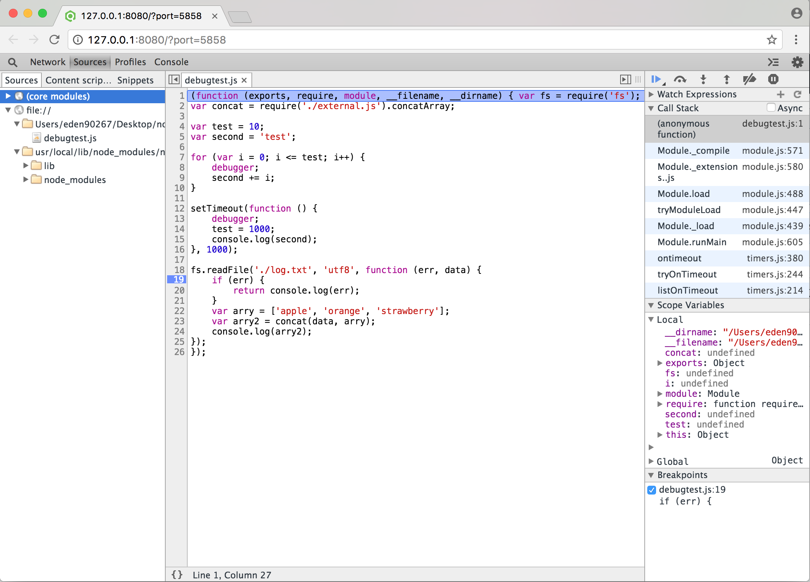

# Node的開發與上線

除錯、測試、任務管理、上線，與支援是所有Node專案的重要元素，而能自動化是一件好事。

## Node應用程式除錯

使用控制台紀錄除錯，它是檢查變數值與結果的簡易方式，但會影響應用程式的動態與行為，且會因其使用而遮蔽一或製造一問題。使用除錯工具會更好，特別是應用程式不只是一小段時。

Node提供內建除錯工具可用於設定程式中斷點並加上監視器以檢視過程中間的結果。它不是最複雜的工具，但足以檢查問題與陷阱。之後會討論Node Inspector這個更複雜的工具。

### Node的除錯工具

Node提供內建的除錯工具。它不複雜，但堪用。

你可在程式中直接插入debugger命令來插入中斷點：

```
for (var i = 0; i <= test; i++) {
    debugger;
    second += i;
}
```

要開始應用程式的除錯，你可在執行應用程式時指定debug選項：

```
node debug application
```

示範：

```
var fs = require('fs');
var concat = require('./external.js').concatArray;

var test = 10;
var second = 'test';

for (var i = 0; i <= test; i++) {
    debugger;
    second+=i;
}

setTimeout(function() {
    debugger;
    test = 1000;
    console.log(second);
}, 1000);

fs.readFile('./log.txt', 'utf8', function(err, data) {
    if (err) return console.log(err);
    var arry = ['apple', 'orange', 'strawberry'];
    var arry2 = concat(data, arry);
    console.log(arry2);
});
```

應用程式以下列命令啟動：

```
node debug debugtest
```

如果在啟動Node應用程式時加上--debug命令列旗標，你也可透過pid連結除錯工具：

```
node debug -p 3383
```

或透過URI連結除錯工具：

```
node debug http://localhost:3000
```

啟動除錯工具，應用程式會停在第一行並列出程式前面部分：

```
< Debugger listening on 127.0.0.1:5858
debug>  ok
break in debugtest.js:1
> 1 var fs = require('fs');
  2 var concat = require('./external.js').concatArray;
  3
```

可使用list命令列出原始碼。list(10)會列出前後各10行程式。

可用setBreakpoint或縮寫的sb命令加上中斷點。

```
debug>sb(19)
debug>sb('external.js',3)
```

也可使用`watch('expression')`命令直接在除錯工具中設定變數或運算式的監視。

```
debug> watch('test');
debug> watch('second');
debug> watch('data');
debug> watch('arry2'); // arr2 is not defined
```

輸入cont或c會執行應用程式到第一個中斷點。在輸出中，我們看到第一個中斷點以及四個監視項目的值。另外兩個值為<error>。因為應用程式目前還沒有進到定義參數(data)與變數(arry2)的函式範圍內。忽略錯誤繼續執行。

```
debug> c
break in debugtest.js:8
Watchers:
  0: test = 10
  1: second = "test"
  2: data = "<error>"

  6
  7 for (var i = 0; i <= test; i++) {
> 8     debugger;
  9     second += i;
 10 }
```

前進到下一個中斷點之前有幾個命令可嘗試。scripts命令列列出目前載入的版本：

```
debug> scripts
  26: bootstrap_node.js
* 61: debugtest.js
  63: external.js
```

version命令顯示V8的版本。再次輸入c以前進到下一個中斷點。

```
debug> version
5.5.372.41
debug> c
break in debugtest.js:8
Watchers:
  0: test = 10
  1: second = "test0"
  2: data = "<error>"

  6
  7 for (var i = 0; i <= test; i++) {
> 8     debugger;
  9     second += i;
 10 }
```

second變數的值已經改變。不幸的是我們無法清除以debugger陳述建構的中斷點，但我們可以清除`setBreakpoint`或`sb`設定的中斷點。要使用`clearBreakpoint`或`cb`，指定腳本的名稱與中斷點的行號：

```
cb('debugtest.js', 19);
```

也可使用unwatch關閉監視：

```
debug> unwatch('second');
```

沒有值的sb將目前行設定中斷點

```
debug> sb();
```

相較於輸入c，可使用next或n命令逐行執行應用程式。

```
debug> n
break in external.js:3
Watchers:
  0: test = "<error>"
  1: second = "<error>"
  2: data = "<error>"

  1 var concatArray = function(str, arry) {
  2     return arry.map(function(element) {
> 3         return str + ' ' + element;
  4     });
  5 }
```

也可執行應用程式的第23行並使用step或s命令**前進至**模組函式：

```
debug> s
break in external.js:3
Watchers:
  0: test = "<error>"
  1: second = "<error>"
  2: data = "<error>"

  1 var concatArray = function(str, arry) {
> 2     return arry.map(function(element) {
  3         return str + ' ' + element;
  4     });
  5 }
```

※ 繼續執行的錯誤：如果應用程式已在尾端，輸入c或cont會導致除錯工具當掉，沒辦法脫離。這是已知的臭蟲。

backtrace或bt提供目前執行背景的回朔。

```
debug> bt
#0 concatArray external.js:3:3
#1 debugtest.js:23:15
```

兩筆記錄，一個是目前應用程式中的行，另一個代表目前在匯入模組函式的行。

可使用out或o返回應用程式。此命令在處於函式時(無論函式位於區域或模組)返回應用程式。

Node的除錯工具是基於REPL所建構的，可輸入repl命令叫出除錯工具的REPL。如果想殺掉腳本，可使用kill命令。想重新啟動腳本，可用restart，但要注意所有中斷點與監視也會被消除。

### Node檢查工具

Node檢查工具(Inspector)利用Chrome或Opera使用的Blink DevTools除錯工具的除錯功能。

此工具的好處是功能比較複雜，且具除錯視覺環境，壞處是他的系統需求。(windows需.NET Framework 2.0 SDK或Microsoft Visual Studio 2005)

```
npm install -g node-inspector
```

要使用它時，以下列命令執行你的Node應用程式。以Node檢查工具執行時對應應用程式需加上.js副檔名：

```
node-debug application.js
```

如果預設瀏覽器是Chrome或Opera，應用程式會在開發者工具中開啟。



上面的程式命令可讓你執行應用程式到下一個中斷點、跳到下一個函式呼叫、進入函式、跳出目前函式、清除所有中斷點、與暫停應用程式。

此視覺介面新功能：

- 左邊列出應用程式/模組
- 右邊視窗列出呼叫堆疊、變數範圍(區域與全域)、以及中斷點

※ 更複雜的開發工具：可用Eclipse IDE使用Nodeclipse等工具

## 單元測試

**單元測試**是隔離應用程式的特定元件以供測試的方式。許多Node模組的tests子目錄提供的測試**都是**單元測試。這些單元測試中很多都是使用接下來會討論的Assert模組。

### 以Assert進行單元測試

**斷言測試**評估表示式，其最終結果值為true或false。Node內建有處理這種斷言測試的模組：Assert。它是供Node內部使用，但我們也可使用它。我們只需知道它不是真正的測試架構。

```
var assert = require('assert');
```

舉例，有個測試Utilities模組的應用程式稱為test-util.js。下面的程式碼測試isArray方法：

```
// isArray
assert.equal(true, util.isArray([]));
assert.equal(true, util.isArray(Array()));
...
```

assert.equal()與assert.strictEqual()方法有兩個必要參數：預期的回應與對回應求值的表達式。若表達式求出true且預期回應是true，則assert.equal方法成功且沒有輸出一**不做**任何表示。

但若預期不符，assert.equal方法以例外回應。(e.g. AssertionError: false == true)

assert.equal()與assert.strictEqual()方法有選擇性的第三個參數，用於失敗時代替預設內容顯示：

```
assert.equal(false, util.isArray([]), 'Test 1Ab failed');
```

這是在測試腳本中執行多個測試時識別哪一個測試失敗的實用方式。此訊息在捕捉到例外時顯示並會將訊息輸出。

下列的Assert模組方法取用相同的三個參數，但測試值與表示式關係不同：

- assert.equal

    若表示式結果與提供值不等則失敗

- assert.strictEqual

    若表示式結果與提供值嚴格不等則失敗

- assert.notEqual

    若表示式結果與提供值相等則失敗

- assert.notStrictEqual

    若表示式結果與提供值嚴格相等則失敗

- assert.deepEqual

    若表示式結果與提供值不等則失敗

- assert.notDeepEqual

    若表示式結果與提供值相等則失敗

- assert.deepStrictEqual

    類似assert.deepEqual()，但原始型別嚴格相等(===)比較

- assert.notDeepStrictEqual

    測試深嚴格不等性

深方法用於複合組件，例如陣列或物件。下面的assert.deepEqual會成功：

```
assert.deepEqual([1,2,3],[1,2,3]);
```

但若是assert.equal則不成功。

其餘的assert方法取用不同的參數。呼叫assert方法並傳入值與訊息等同呼叫assert.isEqual並傳入true作為第一個參數、表達式，與訊息。

```
var val = 3;
assert(val == 3, 'Test 1 Not Equal');
```

等同

```
assert.equal(true, val == 3, 'Test 1 Not Equal');
```

或使用assert.ok這個別名：

```
assert.ok(val == 3, 'Test 1 Not Equal');
```

assert.fail方法會拋出例外。它取用四個參數：值、表示式、訊息，與用於分隔拋出例外時在訊息中的值與表示式的運算子：

```
var assert = require('assert');

try {
    var val = 3;
    assert.fail(val, 3, 'Fails Not Equal', '==');
} catch (e) {
    console.log(e);
}
```

控制台訊息：

```
{ AssertionError: Fails Not Equal
    at Object.<anonymous> (C:\Users\eden_liu\node-learning-2nd\ch11\test2.js:5:12)
    at Module._compile (module.js:571:32)
    at Object.Module._extensions..js (module.js:580:10)
    at Module.load (module.js:488:32)
    at tryModuleLoad (module.js:447:12)
    at Function.Module._load (module.js:439:3)
    at Module.runMain (module.js:605:10)
    at run (bootstrap_node.js:425:7)
    at startup (bootstrap_node.js:146:9)
    at bootstrap_node.js:540:3
  name: 'AssertionError',
  actual: 3,
  expected: 3,
  operator: '==',
  message: 'Fails Not Equal',
  generatedMessage: false }
```

assert.ifError函式取用一個值並在值解析為false以外的任何東西時拋出例外。它是以錯誤物件作為第一個參數的callback函式的好測試：

```
assert.ifError(err); // 只有在true值時拋出
```

最後兩個assert方法是assert.throws與assert.doesNotThrow。第一個方法預期會拋出一個例外；第二個方法不會。兩個方法都取用一段程式作為第一個必要的參數，以及選擇性的錯誤與訊息作為第二、第三的參數。錯誤物件可以是建構元、正規表示式、或驗證函式。在下面程式中，輸出錯誤是因為作為第二個參數的錯誤正規表示式與錯誤訊息不符：

```
var assert = require('assert');

assert.throws(
    function() {
        throw new Error('Wrong value');
    },
    /something/
);
```

你可使用Assert模組建構單元測試。但此模組一個主要限制是你必須對測試做很多包裝以讓測試腳本不會因為一個測試失敗而整個失敗。此時要用Nodeunit等高階單元測試架構。

### 以Nodeunit進行單元測試

Nodeunit提供多測試的腳本進行的方式。寫好腳本後，測試是逐個進行，結果以排列過的方式回報。要使用Nodeunit，你需要以npm全域安裝：

```
npm install nodeunit -g
```

Nodeunit提供簡單的方式來執行一系列測試而不用將所有東西包裝在try/catch區塊中。它支援所有Assert模組測試並提供幾個方法來控制測試。

測試以測試案例組織，每個案例以測試腳本中的物件方法匯出。每個測試案例有一個控制物件，通常稱為test。測試案例中第一個方法呼叫是test元素的expect方法，用以告訴Nodeunit測試案例中有多少個測試。測試案例中最後方法呼叫是test元素的done，用以告訴Nodeunit測試案例結束。介於中間的所有東西組成實際的測試單元。

```
module.exports = {
    'Test 1': function(test) {
        test.expect(3); // 三個測試
        ... // 測試
        test.done();
    },
    'Test 2': function(test) {
        test.expect(1); // 只有一個測試
        ... // 測試
        test.done();
    }
};
```

要執行測試，輸入nodeunit與測試腳本名稱：

```
nodeunit thetest.js
```

範例：

```
var util = require('util');

module.exports = {
    'Test 1': function(test) {
        test.expect(4);
        test.equal(true, util.isArray([]));
        test.equal(true, util.isArray(new Array(3)));
        test.equal(true, util.isArray([1, 2, 3]));
        test.notEqual(true, 1 > 2);
        test.done();
    },
    'Test 2': function(test) {
        test.expect(2);
        test.deepEqual([1,2,3], [1,2,3]);
        test.ok('str' === 'str', 'equal');
        test.done();
    }
}
```

結果：

```
$ nodeunit thetest.js

thetest.js
√ Test 1
√ Test 2

OK: 6 assertions (14ms)
```

### 其他測試架構

除了Nodeunit之外，Node開發者還有其他測試架構選項。某些工具使用起來比較簡單，各有好壞。接下來簡短討論三個架構：Mocha、Jasmine與Vows。

#### Mocha

```
npm install mocha -g
```

Mocha被認為是Esoresso這個測試框架的後繼者。

Mocha可在瀏覽器與Node應用程式中使用。它可經done函式進行非同步測試，而此函式可在同步測試時抑制。Mocha可用於任何斷言函式庫：

```
var assert = require('assert');
describe('MyTest', function () {
    describe('First', function () {
        it('sample test', function () {
            assert.equal('hello', 'hello');
        });
    });
});
```

執行測試：

```
$ mocha testcase.js


  MyTest
    First
      √ sample test


  1 passing (8ms)
```

#### Vows

Vows是行為驅動開發(behavior-driven development，BDD)測試架構，相比其他架構有一個優勢：更好的文件。測試是由測試套件組成，套件是由循序執行的測試組成的批次。**批次**由一或多個平行執行的背景組成，而每個背景組成一個**主題**。程式中的測試稱為vow。Vows自豪能夠清楚分離受測部分(主題)與測試(vow)。

```
npm install vows
```

示範：

```
const PI = Math.PI;

exports.area = function (r) {
    return (PI * r * r).toFixed(4);
};

exports.circumference = function (r) {
    return (2 * PI * r).toFixed(4);
};
```

在此Vows測試應用程式中，圓物件是**主題**，面積與圓周方法是row。兩者都包裝在Vows**背景**中。套件是整個測試應用程式，而**批次**是測試實例(圓與兩個方法)。

範例：具一個批次、一個背景、一個主題，與兩個vow的Vows測試應用程式：

```
var vows = require('vows'),
    assert = require('assert');

var circle = require('./circle');
var suite = vows.describe('Test Circle');

suite.addBatch({
    'An instance of Circle': {
        topic: circle,
        'should be able to calculate circumference': function(topic) {
            assert.equal(topic.circumference(3.0), 18.8496);
        },
        'should be able to calculate area': function(topic) {
            assert.equal(topic.area(3.0), 28.2743);
        }
    }
}).run();
```

執行結果：

```
$ node vowstest.js
·· ✓ OK » 2 honored (0.021s)
```

主題一定是非同步函式或值。相較於使用circle作為主題，可直接參考物件方法作為主題一加上一點來自函式閉包的幫忙。

```
var vows = require('vows'),
    assert = require('assert');

var circle = require('./circle');

var suite = vows.describe('Test Circle');

suite.addBatch({
    'Testing Circle Circumference': {
        topic: function() {
            return circle.circumference;
        },
        'should be able to calculate circumference': function(topic) {
            assert.equal(topic(3.0), 18.8496);
        }
    },
    'Testing Circle Area': {
        topic: function() {
            return circle.area;
        },
        'should be able to calculate area': function(topic) {
            assert.equal(topic(3.0), 28.2743);
        }
    }
}).run();
```

這個版本的範例，每個背景是標題指定的物件：Testing Circle Circumference與Testing Circle Area。在每個背景中有一個主題與一個vow。

可使用多個批次，每個批次可有多個背景，每個背景可有多個主題與vow。

## 保持Node繼續執行

僅管盡可能將應用程式寫好，完整的測試應用程式並加上錯誤處理以優雅的管理錯誤。但還是會出問題一不在預期中的問題使得應用程式掛掉。如果發生這樣的事，你必須有方式確保你的應用程式能夠於你不在場的情況下重新啟動。

Forever是這樣的工具一它確保你的應用程式掛掉會重啟。它也是讓你的應用程式作為daemon在目前的終端機結束後繼續執行的方式。Forever可從命令列使用或作為應用程式的一部分。如果要從命令列啟動，你會需要全域安裝：

```
npm install forever -g
```

相較於直接以Node啟動應用程式，以Forever啟動它：

```
forever start -a -l forever.log -o out.log -e err.log finalserver.js
```

兩個選項與預設值是：minUpTime(default 1000ms)與spinSleepTime(default 1000ms)

前面命令啟動finalserver.js這個腳本指定Forever紀錄、輸出紀錄，與錯誤紀錄的名稱。它還指示應用程式若記錄檔已經存在則繼續加入紀錄資料。

如果發生事情讓腳本當掉，Forever會重啟它。Forever還可以確保Node應用程式在你關掉啟動應用程式的終端機視窗繼續執行。

Forever具選項與動作。上面顯示的start值是一個動作的例子。可用的動作有：

- start

    啟動腳本

- stop

    停止腳本

- stopall

    停止所有腳本

- restart

    重新啟動腳本

- restartall

    重新啟動所有執行中的Forever腳本

- cleanlogs

    刪除所有紀錄

- logs

    列出所有Forever行程的紀錄

- list

    列出所有執行中的腳本

- config

    列出使用者組態

- set <key> <val>

    設定組態鍵值

- clear <key>

    清除組態鍵值

- log <script|index>

    列出<script|index>紀錄

- columns add <col>

    對Forever清單輸出加上欄位

- columns rm <col>

    刪除Forever清單輸出欄位

- columns set <col>

    設定Forever清單輸出所有欄位

下列是httpserver.js作為Forever的daemon啟動後list輸出的範例：

```
$ forever list
info:    Forever processes running
data:        uid  command                            script                                                 forever pid   id log
file                                uptime
data:    [0] b74H "C:\Program Files\nodejs\node.exe" C:\Users\eden_liu\node-learning-2nd\ch11\httpserver.js 13156   13592    C:\
Users\eden_liu\.forever\forever.log 0:0:0:46.728
```

以logs動作列出紀錄：

```
$ forever logs
info:    Logs for running Forever processes
data:        script                                                 logfile
data:    [0] C:\Users\eden_liu\node-learning-2nd\ch11\httpserver.js C:\Users\eden_liu\.forever\forever.log
```

還有大量的選項，包括以上示範的紀錄設置與執行腳本(-s或--silent)、開啟Forever的對話(-v或--verbose)、設定腳本的來源目錄(--sourceDir)等，這些都可以輸入下列命令查詢：

```
forever --help
```

你可在你的程式碼中使用伴隨的forever-monitor模組來直接運用Forever，如該模組的文件所示：

```
npm install forever-monitor
```

```
var forever = require('forever-monitor');

var child = new (forever.Monitor)('httpserver.js', {
    max: 3,
    silent: true,
    args: []
});

child.on('exit', function() {
    console.log(`httpserver.js has exited after 3 restarts`);
});

child.start();
```

此外，可並用Forever與Nodemon，不只可在應用程式無預期失敗時重啟，還可確保程式碼更新時更新程式。

```
npm install -g nodemon
```

Nodemon包裝你的應用程式，相較於使用Node來啟動應用程式，改以Nodemon啟動：

```
nodemon app.js
```

Nodemon會安靜的監控執行應用程式的目錄(與底下的目錄)，檢查檔案的異動。如果發現異動，它會重啟應用程式以反映最近的修改。

可傳遞參數給應用程式：

```
nodemon app.js param1 param2
```

也可使用CoffeeScript

```
nodemon someapp.coffee
```

如想要Nodemon監控目前目錄以外的其他目錄，使用--watch旗標：

```
nodemon --watch dir1 -- watch libs app.js
```

還有其他旗標，見[模組文件](https://github.com/remy/nodemon/)。

為並用Nodemon與Forever，將Nodemon包裝在Forever中並指定--exitcrash選項以確保應用程式當掉時Nodemon會乾淨的結束並將控制交給Forever：

```
forever start nodemon --exitcrash serverfinal.js
```

如收到Forever找不到Nodemon的錯誤，使用完整路徑：

```
forever start /usr/bin/nodemon --exitcrash serverfinal.js
```

如果應用程式當掉，Forever會啟動Nodemon，它會啟動Node腳本，不只確保原始碼改變時執行中的腳本會更新，還能讓意料外的失敗不會使得應用程式永遠離線。

## 以ApacheBench進行效能基準與負載測試

我們需要方法來效能測試我們的Node應用程式，特別是改善效能的過程中。

效能測試由基準測試與負載測試組成。**基準測試**又稱**比較測試**，執行各種版本或修改的應用程式然後判斷哪一個比較好。它是調整應用程式以改善效率與擴張性時很有用的工具。你建構標準化測試，對各種版本執行，然後分析結果。

另一方面，**負載測試**基本上壓迫你的應用程式。你嘗試發現應用程式何時由於太多資源需求或太多並行使用者而導致失敗或趴下。你基本上想要壓迫應用程式直到它失敗為止。失敗是複雜測試的成功。

有多種工具可處理這兩種效能測試，其中之一是ApacheBench。因很少伺服器沒安裝Apache。當想要判斷靜態資料庫連線供重複使用或每次建構連線並拋棄哪一種方式比較好時。會使用ApacheBench來執行測試。

ApacheBench通常稱為ab。ab是命令列工具，能讓我們指定應用程式的執行次數與並行使用者數量。如果想模擬20個使用者同時存取網頁應用程式100次：

```
ap -n 100 -c 20 http://eden.com:8124/
```

提供最後的線很重要，ab需完整的URL，包括路徑。

ab輸出相當多的資訊。下列是一個測試的例子(排除了工具)：

```
ab -n 100 -c 20 http://eden.com:8124/
This is ApacheBench, Version 2.3 <$Revision: 1757674 $>
Copyright 1996 Adam Twiss, Zeus Technology Ltd, http://www.zeustech.net/
Licensed to The Apache Software Foundation, http://www.apache.org/

Benchmarking eden.com (be patient).....done


Server Software:
Server Hostname:        eden.com
Server Port:            8124

Document Path:          /
Document Length:        13 bytes

Concurrency Level:      20
Time taken for tests:   0.046 seconds
Complete requests:      100
Failed requests:        0
Total transferred:      11400 bytes
HTML transferred:       1300 bytes
Requests per second:    2176.42 [#/sec] (mean)
Time per request:       9.189 [ms] (mean)
Time per request:       0.459 [ms] (mean, across all concurrent requests)
Transfer rate:          242.30 [Kbytes/sec] received

Connection Times (ms)
              min  mean[+/-sd] median   max
Connect:        0    0   0.2      0       1
Processing:     3    9   4.6      7      19
Waiting:        3    9   4.6      7      19
Total:          3    9   4.7      8      19

Percentage of the requests served within a certain time (ms)
  50%      8
  66%      9
  75%     10
  80%     14
  90%     17
  95%     19
  98%     19
  99%     19
 100%     19 (longest request)
```

我們在意的是每個測試花了多少時間與測試完成的累積分佈(百分比)。根據此輸出，請求的平均時間(第一個Time per request的值)是9.189毫秒。這是使用者等待回應的時間。第二行與處理量有關，可能沒第一行重要。

累積分佈提供一段時間內請求處理的百分比資訊。同樣的，這表示回應時間介於8與19毫秒，大部分回應在19毫秒內處理(95%)。

最後一個要注意的值是request per second一此例中為2176.42。這個值可預測應用程式的擴展性，因為它讓我們知道每秒最大請求數一也就是存取應用程式的上限。但你必須在不同時間與不同負載下進行測試，特別是如果你在系統進行其他服務時執行測試。

※ 也可使用Loadtest應用程式執行負載測試：

```
npm install -g loadtest
```

較ApacheBench好的地方是你可以設定使用者以及請求：

```
loadtest [-n requests] [-c concurrency] [-k] URL
```

```
loadtest -n 100 -c 20 -k http://eden.com:8124/
[Tue Apr 25 2017 06:10:12 GMT+0800 (+08)] INFO Requests: 0 (0%), requests per second: 0, mean latency: 0 ms
[Tue Apr 25 2017 06:10:12 GMT+0800 (+08)] INFO
[Tue Apr 25 2017 06:10:12 GMT+0800 (+08)] INFO Target URL:          http://eden.com:8124/
[Tue Apr 25 2017 06:10:12 GMT+0800 (+08)] INFO Max requests:        100
[Tue Apr 25 2017 06:10:12 GMT+0800 (+08)] INFO Concurrency level:   20
[Tue Apr 25 2017 06:10:12 GMT+0800 (+08)] INFO Agent:               keepalive
[Tue Apr 25 2017 06:10:12 GMT+0800 (+08)] INFO
[Tue Apr 25 2017 06:10:12 GMT+0800 (+08)] INFO Completed requests:  100
[Tue Apr 25 2017 06:10:12 GMT+0800 (+08)] INFO Total errors:        0
[Tue Apr 25 2017 06:10:12 GMT+0800 (+08)] INFO Total time:          0.09493280400000001 s
[Tue Apr 25 2017 06:10:12 GMT+0800 (+08)] INFO Requests per second: 1053
[Tue Apr 25 2017 06:10:12 GMT+0800 (+08)] INFO Mean latency:        14.9 ms
[Tue Apr 25 2017 06:10:12 GMT+0800 (+08)] INFO
[Tue Apr 25 2017 06:10:12 GMT+0800 (+08)] INFO Percentage of the requests served within a certain time
[Tue Apr 25 2017 06:10:12 GMT+0800 (+08)] INFO   50%      11 ms
[Tue Apr 25 2017 06:10:12 GMT+0800 (+08)] INFO   90%      26 ms
[Tue Apr 25 2017 06:10:12 GMT+0800 (+08)] INFO   95%      27 ms
[Tue Apr 25 2017 06:10:12 GMT+0800 (+08)] INFO   99%      28 ms
[Tue Apr 25 2017 06:10:12 GMT+0800 (+08)] INFO  100%      28 ms (longest request)
```